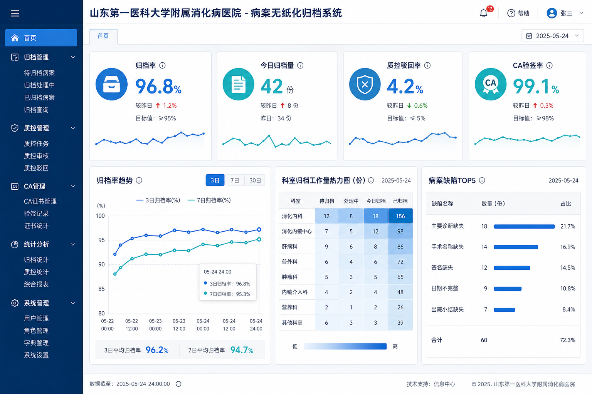

# 山东第一医科大学附属消化病医院病案无纸化归档系统

- **生产环境 Host**: [https://26-sd-mr-bid.softwarelink.net/](https://26-sd-mr-bid.softwarelink.net/)
- **代码仓库 Repo**: [https://github.com/softwarelink-net/26-sd-mr-bid](https://github.com/softwarelink-net/26-sd-mr-bid)

---

## 控制台预览



---

## 部署与运行说明

### 1. 环境要求
- Node.js >= 18.x
- npm >= 9.x

### 2. 安装依赖
```bash
npm install
```

### 3. 生成本站 SQLite（首次或 schema 变更后）
```bash
npm run db:build
cp schema.sql public/schema.sql
```
从 `schema.sql` 生成 `public/data/site.sqlite`。

### 4. 本地运行
```bash
npm run dev
```

### 5. 演示账号
| 角色 | 用户名 | 密码 | 权限说明 |
| :--- | :--- | :--- | :--- |
| 超级管理员 | `admin` | `Admin@2026` | 拥有系统全部模块的最高管理权限 |
| 病案质控员 | `archivist` | `Archive@2026` | 负责病案归档终审、质控缺陷驳回与封存 |
| 临床医师 | `doctor` | `Doctor@2026` | 科室病案提交、PDF 转换与科室质控 |
| 外部审计 | `auditor` | `Audit@2026` | 调阅审计日志、验签与合规检查 |
| 科研借阅 | `researcher` | `Research@2026` | 申请病案科研调阅与水印预览 |

### 6. 生产构建
```bash
npm run build
```

### 7. 常用脚本一览
- `npm run dev`：本地开发。
- `npm run build`：生成 SQLite + 编译前端（`prebuild` 自动执行 `db:build`）。
- `npm run db:build`：从 `schema.sql` 重建 SQLite 文件。
- `npm run deploy`：构建并同步静态资源与 SQLite 至 R2。
- `npm run preview`：预览构建产物。

### 8. 目录结构
```text
26-sd-mr-bid/
├── docs/assets/                 # 预览图
├── public/
│   ├── data/site.sqlite         # 构建生成的本站 SQLite
│   └── schema.sql               # 浏览器首访种子 SQL
├── src/
│   ├── api/client.js            # 视图层 API（委托 db/repository）
│   ├── db/
│   │   ├── config.js            # SQLite URL / 演示密码
│   │   ├── engine.js            # sql.js 加载 / 持久化
│   │   ├── repository.js        # 业务 SQL（登录、归档、质控…）
│   │   └── sql-utils.js         # schema 执行工具
│   ├── components/
│   ├── layouts/
│   ├── router/
│   ├── stores/
│   └── views/
├── worker/
│   └── index.js                 # allworld 参考实现（静态 + SQLite 透传）
├── schema.sql                   # SQLite 建表与种子数据
├── scripts/
│   ├── build-sqlite.mjs         # schema → site.sqlite
│   └── deploy-allworld.mjs      # R2 发布
└── README.md
```

---

## 招标公告全文

*   **标题**：山东第一医科大学附属消化病医院病案无纸化归档系统采购项目（61200）竞争性磋商公告
*   **项目发包方**：山东第一医科大学附属消化病医院
*   **项目编号**：SDGP370000000202602007492
*   **项目发布时间**：2026-08-14 23:23
*   **关键词**：山东第一医科大学附属消化病医院, 病案无纸化归档系统, 电子病案系统, SDGP370000000202602007492, 医院信息化, 竞争性磋商, 山东政府采购
*   **摘要**：受山东第一医科大学附属消化病医院委托，山东三木招标有限公司对 SDGP370000000202602007492、山东第一医科大学附属消化病医院病案无纸化归档系统采购项目（61200）组织竞争性磋商，采购预算 40 万元，采购 1 套病案无纸化归档软件系统，合同签订后 60 日历天内完成实施上线并试运行。
*   **技术要点**：
    1. 异构临床业务系统（HIS/EMR/PACS/LIS/手麻）诊疗文书的标准化汇聚与 PDF/A 固化转换；
    2. 国密 CA 电子签名、时间戳（TSA）集成与法律级防篡改哈希指纹校验；
    3. 三级质控工作流（科室质控、病案终审、缺陷驳回闭环）与前置逻辑质控规则引擎；
    4. 动态隐形/显式防泄密安全水印、分级借阅授权与全生命周期审计日志追踪。
*   **技术创新性**：
    1. 边缘无服务器轻量架构（Cloudflare Workers 静态 + 浏览器 sql.js + R2 SQLite），极大降低医院信息化采购与长期运维成本；
    2. 智能多级文档渲染管线与动态指纹溯源技术，实现毫秒级病案调阅与司法级验签；
    3. 响应式医疗级 UI/UX 设计，结合 RBAC 权限与不可篡改审计追踪机制。

---

## 免责声明

1. **数据来源与合规性**：本系统展示的所有招标信息、项目背景及采购需求均来源于公开招投标平台（如中国招标投标公共服务平台、中国建设银行龙集采平台等）。系统仅用于技术方案演示、架构原型验证与演示搭建，不涉及任何商业非法抓取或数据篡改。
2. **技术实现路径**：本系统前端基于 Vue 3 + Tailwind CSS + sql.js 构建，Worker 仅负责静态托管与 R2 SQLite 文件同步，数据存储采用每站独立 R2 `.sqlite` 文件，完整符合分布式高可用与银企对接安全标准。
3. **保密承诺**：开发团队严格遵守保密义务，系统内示例数据均经过伪化脱敏处理（Anonymized），不包含真实患者医疗健康信息（PHI）或建行敏感金融交易数据。
4. **知识产权与巧合声明**：本系统中涉及的商标、机构名称（中国建设银行、川北医学院附属医院等）归各自合法持有人所有。演示代码与系统架构若与实际投产系统存在相似之处，纯属技术通用设计之巧合。
5. **免责条款**：本演示系统不具备实际金融扣款功能，不承担因非授权使用、不可抗力或第三方平台接口变更所导致的任何法律责任与经济损失。
